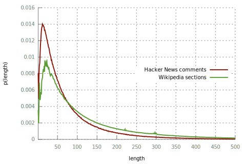

# Wiki Data 
Here, we prepare training data from an English Wikipedia data dump.
Nothing too interesting, just a series of tedious steps because I don't know any better tools for this.

## Steps
### Download
Download a dump of the English Wikipedia in XML format.
This can be done here for example:
[https://dumps.wikimedia.org/backup-index.html](https://dumps.wikimedia.org/backup-index.html).
What we are interested in is a file like `enwiki-latest-pages-articles.xml.bz2`.

The dump that we experiment with here is named `enwiki-20190201-pages-articles.xml` and has a
compressed size of 15GB.

### Split
I use [xmldump2files.py](https://github.com/adamwulf/wikipedia2text/blob/master/xmldump2files.py) 
to split the XML dump into individual files, one per document:
```
bzcat enwiki-latest-pages-articles.xml.bz2 | ./xmldump2files.py /dev/stdin docs
```
Documents will be saved in some kind of hash tree in the `docs/` directory.
For example, there will be the file `docs/2f/7c/Abraham_Lincoln.txt`.

### Filter Documents
I get about 10M extracted documents, as `xmldump2files.log` shows:
```
Redirects 8465477  Deleted 0  Disambigs 271019  Lists 231905  Skipped 0  Wrote 10200000 50.01GiB  Total 10200000 50.01GiB  (185%)
```
The official
[Wikipedia statistics](https://en.wikipedia.org/wiki/Wikipedia:Size_of_Wikipedia#Annual_growth_rate_for_the_English_Wikipedia)
say that there are currently about 5.8M articles.
The dump that I downloaded contains a lot of non-articles.
Note that [our version of xmldump2files.py](xmldump2files.py) already filters out redirects and disambiguations.
The most serious remaining offenders can be found like this:
```
find docs/ -name '*.txt' \
  | grep -o '/[^/%]*%3' \
  | sort \
  | uniq -c \
  | awk '{print $1,$2}' \
  | sort -k1,1 -n \
  | tail -n20
```
I've collected them in `doc-list-filter.grep` to filter the document list:
```
find docs -name '*.txt' | grep -vF -f doc-list-filter.grep > docs.txt
```
I'm left with 5.78M of 10.2M documents.

### Convert to Markdown
We convert from the MediaWiki markup to Markdown using [pandoc](https://pandoc.org/),
together with a custom filter [filter_markdown.py](filter_markdown.py) written with
[panflute](http://scorreia.com/software/panflute/)
that removes content that is not useful for us.

Here's how to convert and filter one document:
```
pandoc --wrap=none -f mediawiki -t markdown < test/out/7a/77/Astronomer.txt \
  | pandoc --filter filter_markdown.py -t markdown
```
The script `convert-doc.sh` applies this conversion to stdin.
We can use [GNU Parallel](http://www.gnu.org/s/parallel) to apply it to all articles,
writing the output to the filename suffixed by `.md`:
```
parallel --verbose -j 8 ./convert-doc.sh '<' {} '>' {.}.md \
  < wiki/docs.txt \
  2>&1 | tee convert.log
```
This may take a few days.

There are some downsides to using Pandoc here, since it does not handle Wikipedia template
references, and instead seems to remove them in the output. This leads to a few sentences
missing words in the middle. This is a relatively rare occasion, so it should not be much
of a problem.

Also, the conversion crashes sometimes:
```
/home/leod/src/hncynic/data-wiki/convert-doc.sh < docs/85/Munich%E2%80%93Augsburg_railway.txt > docs/85/Munich%E2%80%93Augsburg_railway.md
Traceback (most recent call last):
  File "/home/leod/src/hncynic/data-wiki/filter_markdown.py", line 114, in <module>
    main()
  File "/home/leod/src/hncynic/data-wiki/filter_markdown.py", line 98, in main
    return run_filter(action, prepare=prepare, doc=doc)
  File "/home/leod/.local/lib/python3.6/site-packages/panflute/io.py", line 260, in run_filter
    return run_filters([action], *args, **kwargs)
...
  File "/home/leod/.local/lib/python3.6/site-packages/panflute/elements.py", line 1061, in __init__
    self.header = header
  File "/home/leod/.local/lib/python3.6/site-packages/panflute/elements.py", line 1097, in header
    raise IndexError(msg)
IndexError: table header has an incorrect number of cols: 6 rows but expected 8
pandoc: Error running filter /home/leod/src/hncynic/data-wiki/filter_markdown.py
Filter returned error status 1
```
How often?
```
$ grep "pandoc: Error running filter" convert.log | wc -l
208757
```
This means we'll loose about 3.6\% of the articles while converting to Markdown.
Not cool, but I can live with it.

### Convert to TSV
We use each section of an article as an individual training example.

```
find docs -name '*.md' > docs.md.txt
parallel --verbose -j 8 \
  ./clean_text.sh \
    '<' {} \
    '|' ./md_to_tsv.py {} \
    '>' {.}.tsv \
  < docs.md.txt \
  > convert.tsv.log 2>&1
```

The resulting data is far from perfect, as e.g. it still contains some leftover Wiki markup.

## Concatenate
Split into train/dev/test (this time it's easier because we have one file per title):
```
find docs -name '*.tsv' > docs.tsv.txt
shuf docs.tsv.txt > docs.tsv.shuf.txt
awk 'NR <= 2000' docs.tsv.shuf.txt > docs.tsv.dev.txt
awk 'NR > 2000 && NR <= 4000' docs.tsv.shuf.txt > docs.tsv.test.txt
awk 'NR > 4000' docs.tsv.shuf.txt > docs.tsv.train.txt
```
Sanity check:
```
$ sort -u docs.tsv.txt | wc -l
5801101
$ cat docs.tsv.{train,dev,test}.txt | sort -u | wc -l
5801101
```
Concatenate:
```
cat $(cat docs.tsv.dev.txt) > dev.tsv
cat $(cat docs.tsv.test.txt) > test.tsv

# SLOW:
while read file; do cat $file; done < docs.tsv.train.txt > train.tsv
```
I found the last command for concatenating the training data to be quite slow (I estimated
that it would take more than 1 day to complete). Maybe this is because of the overhead of
starting a new `cat` process for each of the almost 6M files. I've written a small Python
utility that makes this step run significantly faster:
```
./cat_stdin.py < docs.tsv.train.txt > train.tsv
```

### Normalization?
Now, we could again apply Moses preprocessing etc. but I'm not sure if it is the right way to go,
due to all the special symbols such as Latex code and the triple backticks in Markdown. Also,
Wikipedia text itself already is pretty well normalized, so we probably can get away without
tokenization.

Okay, so for now the only normalization we do here is to lowercase the titles.
```
./preprocess_tsv.sh train
./preprocess_tsv.sh dev
./preprocess_tsv.sh test
```

### Issues
After all this, there still are a bunch of issues with the data. Here's what I know of:
- [`md_to_tsv.py`](md_to_tsv.py) occasionally outputs a title like this:
  ```
  2015 africa cup of nations qualification group e: ------------------------------------------------------------------------
  ```
  This probably is because of a failed header detection. This happens in only 9908 of the 16593956
  titles in the training data.
- The articles sometimes still contain table markup.
- Even though I filtered many redirects, the training data still contains some.
  I count 15768 (0.1% of all examples) in the final training data.
- As mentioned above, some Wikipedia template markup such as automatic unit conversion is not handled,
  resulting in incomplete sentences.

### BPE
Similar to the [Hacker News data](../data), we learn a BPE word segmentation on the training data.
We have a lot more training data here than before, so we use [fastBPE](https://github.com/glample/fastBPE),
which is a faster implementation.

Still, learning BPE on the full data takes a long time, so let's just use a subsample:
```
paste train.pp.{titles,comments} | shuf > train.pp.shuf.titles-comments
cut -f1 train.pp.shuf.titles-comments | head -n 2000000 > bpetrain.pp.titles
cut -f2 train.pp.shuf.titles-comments | head -n 2000000 > bpetrain.pp.comments

fastBPE/fast learnbpe 32000 bpetrain.pp.titles bpetrain.pp.comments > bpecodes
```
Apply segmentation to data:
```
for i in {test,dev,train}; do
  for j in {comments,titles}; do
    fastBPE/fast applybpe $i.pp.bpe.$j $i.pp.$j bpecodes
  done
done
```

### Training the model
See [../train-wiki](../train-wiki).

## Appendix
### Section Lengths
How long are the texts from the training examples?
```
../data/length-distr.awk < train.pp.comments > length-distr.train.pp.comments
gnuplot \
  ../data/length-distr.plot \
  -e "set ylabel 'p(length)'; plot '../data/length-distr.data.train.pp.comments' t 'Hacker News comments' w l ls 1, 'length-distr.train.pp.comments' t 'Wikipedia sections' w l ls 2" \
  > length-distr.train.pp.comments.svg
```


Interestingly, the distribution of Wikipedia sections is a lot less smooth than the one of Hacker News comments.
Is this an effect of our data processing, or something inherent in the data?
