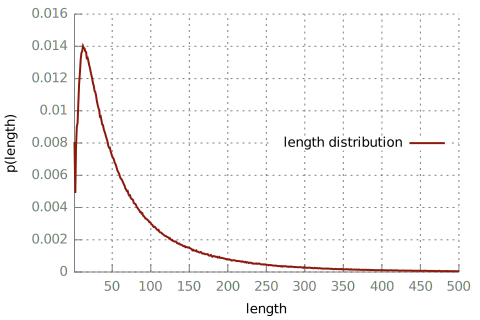

# Data
This directory contains some simple tools for analyzing and transforming the HN dump data.

## Steps
### Raw Data
Starting point is this awesome Hacker News data dump: https://archive.org/details/14566367HackerNewsCommentsAndStoriesArchivedByGreyPanthersHacker

### Extract
Here, we extract only the top-level comments from the raw HN data dump and convert to
simple TSV for the processing steps that will follow.
For now, we ignore comments that are replies, since they would require additional modelling.
```
./extract.py < 14m_hn_comments_sorted.json > top_level_hn_comments.tsv
```
The script also converts from HTML to Markdown using [html2text](https://pypi.org/project/html2text/).
Note that the entries in the JSON seem to come from different sources, with multiple formats.
For example, some entries use double newlines to represent paragraphs, while others use the HTML `<p>`.
`extract.py` tries to normalize the data a bit, but it is likely that there will be some remaining
inconsistencies.

I get 3331156 extracted title-comment pairs, with the following statistics printed by `extract.py`:
```
stories:      2461338
comments:     11629633 (4.72 per title)
top-level:    3331156 (28.6437%)
ignored rows: 0.1507%
invalid rows: 0.2189%
deleted rows: 2.8940%
```

Some of the title-comment pairs may be contained multiple times, let's deduplicate:
```
sort -u -t$'\t' -k 3,3 -k 4,4 top_level_hn_comments.tsv > top_level_hn_comments.dedupe.tsv
```
Indeed, it looks like a few (8999) title-comment pairs are duplicates in my case:
```
$ wc -l top_level_hn_comments.tsv top_level_hn_comments.dedupe.tsv
   3331156 top_level_hn_comments.tsv
   3322157 top_level_hn_comments.dedupe.tsv
```

### Split
Split the data into train, test and dev. This is just so that we can see how the model performs
on unseen data during training (dev) and after training (test).

We have to be a bit careful here so that we don't get the same title in both train and dev/test.
The TSV format isn't very well suited for this, so I've written a stupid script for sampling.
Sort by title, then sample into train/dev/test, allocating 0.1% for dev and test data each:
```
sort -t$'\t' -k3,3 top_level_hn_comments.dedupe.tsv > top_level_hn_comments.dedupe.sorted-by-title.tsv 
./sample_train_dev_test.py --train data.train.tsv \
                           --dev data.dev.tsv 0.1 \
                           --test data.test.tsv 0.1 \
    < top_level_hn_comments.dedupe.sorted-by-title.tsv
```
Just to be sure, let's double check that we have no title overlap:
```
$ wc -l data.{train,dev,test}.tsv
   3315886 data.train.tsv
      3312 data.dev.tsv
      2959 data.test.tsv
   3322157 total

$ cut -f3 top_level_hn_comments.dedupe.sorted-by-title.tsv | sort -u | wc -l
595625

$ for i in {train,test,dev}; do cut -f3 data.$i.tsv | sort -u | wc -l; done
594479
559
587

$ expr 594479 + 559 + 587
595625
```
Phew, looks like the titles have been distributed without overlap. We can also see that we have
about 600K unique titles in training, with more than 5 comments each. Let's hope that will
be enough data!

### Tokenize
Next, we normalize the data further. First, we note that a large number of comments contain links.
As a result of the conversion to Markdown, there are different ways of specifying links,
which `normalize_links.sh` tries to reduce just to plain-text URLs. Then, we tokenize the
titles and comments and split from TSV into separate files for parallel line-aligned titles/comments.
We also lowercase titles here, since they are only seen as an input and we think there is not much to
be gained from this signal for this task.
```
./preprocess_tsv.sh data.train
./preprocess_tsv.sh data.dev
./preprocess_tsv.sh data.test
```
Sanity check that everything is still aligned:
```
$ for i in {train,dev,test}; do wc -l data.$i.tsv data.$i.pp.comments data.$i.pp.titles | grep -v total; done
   3315886 data.train.tsv
   3315886 data.train.pp.comments
   3315886 data.train.pp.titles
   3312 data.dev.tsv
   3312 data.dev.pp.comments
   3312 data.dev.pp.titles
   2959 data.test.tsv
   2959 data.test.pp.comments
   2959 data.test.pp.titles
```

### Learn BPE
Take some subset of the training data for learning BPE (for segmenting the text into subword units):
```
cat <(shuf data.train.pp.comments | head -n 500000) \
    <(shuf data.train.pp.titles | head -n 500000) \
    > bpetrain
```

Use [subword-nmt](https://github.com/rsennrich/subword-nmt.git) to learn BPE segmentation:
```
subword-nmt learn-bpe -s 24000 < bpetrain > bpecodes
```

### Apply BPE
Take the codes we just learned to segment train, dev and test data:
```
for i in {train,test,dev}; do
  for j in {comments,titles}; do
    subword-nmt apply-bpe --codes bpecodes < data.$i.pp.$j > data.$i.bpe.$j
  done
done
```

### Training the model
See [../train](../train).

## Appendix
### Comment Lengths
Unfortunately, HN comments will often go on and on. Assumably, the model will not be able to generate
coherent comments of such length, especially with the relatively small amount of training data we have.
A question then becomes if we should filter long comments from the training data, or even split up
long comments into multiple training examples (for example at the paragraph level, since HN users care
so much about structuring their comments nicely).

Let's first see what we have in terms of words per comment...
```
./length-distr.awk \
  < data.train.pp.comments \
  | gnuplot length-distr.plot -e "set ylabel 'p(length)'; plot '-' t 'length distribution' w l ls 1" \
  > length-distr.data.train.pp.comments.svg

./length-distr.awk \
  < data.train.pp.comments \
  | gnuplot length-distr.plot -e "set ylabel 'p(<= length)'; plot '-' u 1:(cumsum(\$2)) t 'cumulative length distribution' w l ls 2" \
  > length-distr-cumulative.data.train.pp.comments.svg
```
 

There are many long comments, but it's not as bad as I thought: more than 50% of all top-level
comments have fewer than 50 tokens.

What's the average number of paragraphs per comment? (This is starting to feel more and more like
some kind of Jupyter notebook)
```
./paragraph-distr.awk \
  < data.train.pp.comments \
  | gnuplot length-distr.plot -e "set ylabel 'avg. numbers of paragraphs'; plot '-' t 'paragraphs' w l ls 1" \
  > paragraph-distr.data.train.pp.comments.svg
```


How neat.

### Format of the Raw HN Data Dump
A brief look into the format of the raw HN data dump.

Each line is one JSON object. Each object has an ID, by which the lines are sorted.
This is the first line, representing a story, pretty-printed with `head -n1 14m_hn_comments_sorted.json | jq`:
```
{
  "body": {
    "kids": [
      487171,
      15,
      234509,
      454410,
      82729
    ],
    "descendants": 15,
    "url": "http://ycombinator.com",
    "title": "Y Combinator",
    "by": "pg",
    "score": 61,
    "time": 1160418111,
    "type": "story",
    "id": 1
  },
  "source": "firebase",
  "id": 1,
  "retrieved_at_ts": 1435938464
}
```

This is a comment:
```
{
  "body": {
    "kids": [
      455092
    ],
    "parent": 534,
    "text": "which ones are you thinking about? ",
    "id": 586,
    "time": 1172193356,
    "type": "comment",
    "by": "gustaf"
  },
  "source": "firebase",
  "id": 586,
  "retrieved_at_ts": 1435974128
}
```

As explained somewhat in `extract.py`, there will be some deviations from this layout.
