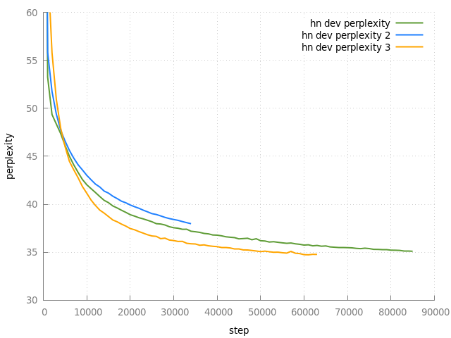

# Transfer Learning

We take the model trained on Wikipedia data and continue training on HN data.

## Steps

- Apply wiki BPE to HN data
  ```
  for i in {dev,test,train}; do
    cut -f3 ../data/data.$i.tsv \
      | ~/src/hncynic/data/mosesdecoder/scripts/tokenizer/lowercase.perl \
      > $i.pp.titles
  done
  for i in {dev,test,train}; do
    cut -f4 ../data/data.$i.tsv | ~/src/hncynic/data/normalize_links.sh > $i.pp.comments
  done
  for i in {dev,test,train}; do
    for j in {comments,titles}; do
      ../data-wiki/fastBPE/fast applybpe \
        $i.pp.bpe.$j \
        $i.pp.$j \
        ../data-wiki/bpecodes
    done
  done
  ```
- Vocabulary
  ```
  onmt-build-vocab --save_vocab vocab.titles train.pp.bpe.titles
  onmt-build-vocab --save_vocab vocab.comments train.pp.bpe.comments
  ```
- Shuffle
  ```
  paste train.pp.bpe.{titles,comments} | shuf > train.pp.bpe.shuf.titles-comments
  cut -f1 < train.pp.bpe.shuf.titles-comments > train.pp.bpe.shuf.titles
  cut -f2 < train.pp.bpe.shuf.titles-comments > train.pp.bpe.shuf.comments
  ```



Legend:
- `hn dev perplexity`: Continue from model pretrained on Wiki data for 68K steps
- `hn dev perplexity 2`: Continue from model pretrained on Wiki data for 192K steps
- `hn dev perplexity 3`: Continue from model pretrained on Wiki data for 192K steps, reset learning rate schedule
