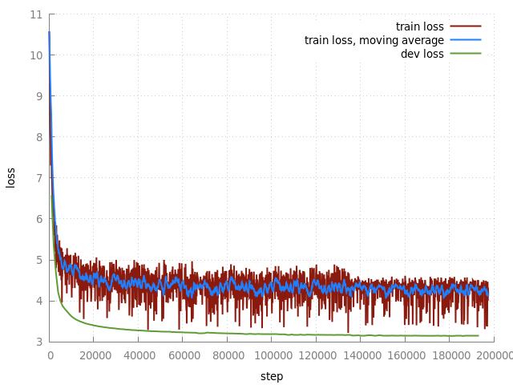
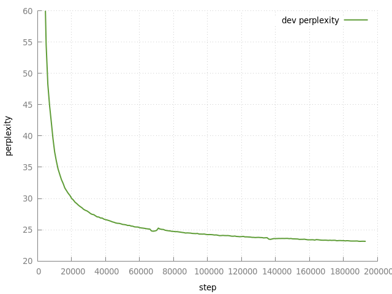

# Wiki Train
Here, we train a model to predict Wikipedia article sections from the title.

When I trained a model on the Hacker News data (see [../train](../train)), I used an off-the-shelf Transformer translation model. In particular, the encoder and decoder had the same number of layers. In hindsight, this may not have been an ideal choice. For our task, intuitively, the decoder has a much more challenging task than the encoder, given that it has to generate long, cohesive text. Furthermore, compared to translation, we have less symmetry between encoding and decoding here, as there is no direct relation between input and output sequence lengths. In fact, it would probably be a good idea to simply encode the title into a fixed-size vector and drop the decoder-encoder attention. Alternatively, it would make sense to completely drop the title encoder, and instead train a pure language model on titles concatenated with the comments. This is for example done by the awesome [stackroboflow](https://stackroboflow.com) and OpenAI [recently used](https://openai.com/blog/better-language-models/) language models to perform well at NLP tasks without any task-specific training.

However, out of a mixture of laziness, curiosity and a lack of GPUs, I'll continue to use encoder-decoder models. To try to account for the asymmetry between titles and comments, I'll reduce the number of layers in the encoder and increase the size of the decoder. This OpenNMT model is defined in [my_transformer.py](my_transformer.py), using 3 encoder layers and 9 encoder layers (instead of 6 and 6 as in the default model). I have no idea yet if this is a good idea, but let's just go for it.

The steps are very similar to [training on HN data](../train) (other than some inconsistencies in the filenames...).

## Steps
### Data Preparation
See [../data-wiki](../data-wiki).

### Vocabularies
```
onmt-build-vocab --save_vocab vocab.titles ../data-wiki/train.pp.bpe.titles
onmt-build-vocab --save_vocab vocab.comments ../data-wiki/train.pp.bpe.comments
```
Let's check vocabulary sizes...
```
$ wc -l vocab.*
 61427 vocab.comments
 25582 vocab.titles
```
Whoops, 61427 seems pretty large given that BPE was trained with 32K merges.
Looking at the comment vocabulary, we can see that of course there are plenty of additonal Chinese or Japanese characters that were not seen when learning BPE. 

One workaround for now is to just ignore examples in the training data that were not seen when learning BPE for creating the vocabulary.
```
$ ../data-wiki/fastBPE/fast applybpe bpetrain.pp.bpe.comments ../data-wiki/bpetrain.pp.comments ../data-wiki/bpecodes
$ onmt-build-vocab --save_vocab vocab.no-new.comments bpetrain.pp.bpe.comments
$ wc -l vocab.no-new.comments
47023 vocab.no-new.comments
```
Better, I guess, but let's still remove the Chinese characters (my GPU only has 8GB memory!).
```
$ ./filter_vocab.sh < vocab.no-new.comments > vocab.no-new.filtered.comments
$ wc -l vocab.no-new.filtered.comments
38139 vocab.no-new.filtered.comments
```
Now, if we were to train with this vocabulary, any Chinese or otherwise unseen character in the data would be seen as `<unk>` (unknown word) by the model. If that happens frequently enough, the model
will learn to occasionally produce `<unk>` tokens itself. I want to avoid that, so I'll filter the
training data as to remove all comments containing at least one unknown word:
```
$ paste ../data-wiki/train.pp.bpe.{titles,comments} \
    | ./filter_unk.py vocab.no-new.filtered.comments \
    > train.pp.bpe.filtered.titles-comments
[1.0M]
[2.0M]
[3.0M]
[4.0M]
[5.0M]
[6.0M]
[7.0M]
[8.0M]
[9.0M]
[10.0M]
[11.0M]
[12.0M]
[13.0M]
[14.0M]
[15.0M]
[16.0M]
Done. Filtered 155208 lines out of 16593956 (0.94%)
Invalid lines: 293 (0.00%)
```

### Shuffle
```
shuf train.pp.bpe.filtered.titles-comments > train.pp.bpe.filtered.shuf.titles-comments
cut -f1 < train.pp.bpe.filtered.shuf.titles-comments > train.pp.bpe.filtered.shuf.titles
cut -f2 < train.pp.bpe.filtered.shuf.titles-comments > train.pp.bpe.filtered.shuf.comments
```

### Train
See [opennmt_config.yml](opennmt_config.yml) for the OpenNMT config -- paths need to be adjusted.
I set the maximum sequence length to 512, which excludes 977865 (about 6%) of the 16593956 title-comment pairs (we could split these examples after 512 tokens instead, leave that for future work I guess). The large sequences means that there will be less variation in a single batch compared to machine translation data. In an attempt to compensate for that, I increased the effective batch size to 65536 tokens.

#### Watching it Train
```
./train_loss_from_log.sh < model/train.log > model.step-trainloss
gnuplot ../train/train.plot -e "plot '-' t 'train loss' w lines ls 1" < model.step-trainloss > train.svg
```



