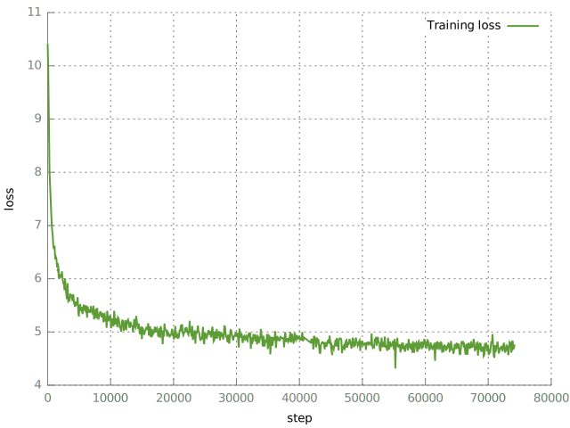

# Train

We train a [Transformer](http://jalammar.github.io/illustrated-transformer/) encoder-decoder model 
on the extracted title-comment pairs, considering the prediction of comments
as a translation problem by modelling `p(comment|title)`. This can also be interpreted as a
language model conditioned on the submission title.

It is not obvious to me if this should work at all, since I'd think that the `p(comment|title)` distribution
has a significantly larger entropy than the usual translation models. Let's just see what'll happen...

## Steps
### Data Preparation
See [../data](../data).

### Shuffle
Now that we're done with data preparation, let's prepare the data some more.
```
paste ../data/data.train.bpe.{titles,comments} | shuf > data.train.bpe.shuf.titles-comments
cut -f1 < data.train.bpe.shuf.titles-comments > data.train.bpe.shuf.titles
cut -f2 < data.train.bpe.shuf.titles-comments > data.train.bpe.shuf.comments
```

### Vocabularies
Since titles are lowercased and comments are not, and comments contain other additional symbols,
such as Markdown or links, we build two vocabularies:
```
onmt-build-vocab --save_vocab vocab.titles data.train.bpe.shuf.titles
onmt-build-vocab --save_vocab vocab.comments data.train.bpe.shuf.comments
```

### Train
Adjust settings and paths in `opennmt_config.yml` if necessary. Let's hope TensorFlow is ready
to go, and start training. OpenNMT-tf will save checkpoints periodically (as configured),
so training can be continued from there in case something crashes or if your mother rips out
the power plug.
```
onmt-main train --config opennmt_config.yml --model_type Transformer --num_gpus 1
```
I trained the model for about 40K steps with `opennmt_config.yml`. I noticed that the loss wasn't
improving much after that, so I got worried and increased the batch size (known to help with
training Transformer models) by performing gradient accumulation as in `opennmt_config_larger_batch.yml`.
As can be seen in the plot below, this seems to have helped.



Unfortunately, I don't have a plot for the dev loss, since I forgot to turn on dev evaluation.
What a bummer.

### Evaluate

### Export
Once the model has finished training, we can export it for serving as follows:
```
CUDA_VISIBLE_DEVICES= onmt-main export --export export1 --config opennmt_config_larger_batch.yml sample.yml --num_gpus 0
```
Here, we save the exported model in the directory `export1/`.

### Serve
See [../serve](../serve).
