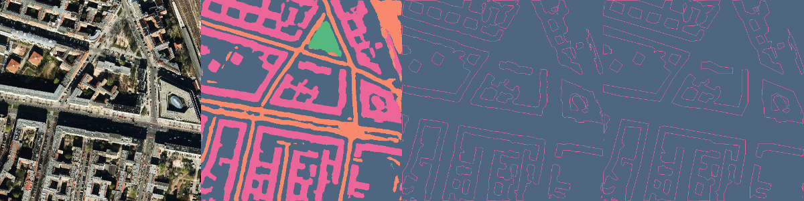
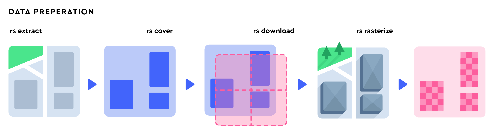
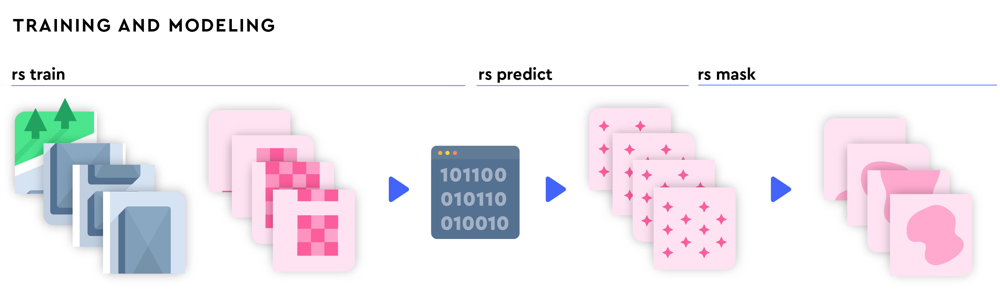
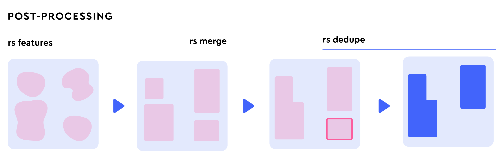

<h1 align='center'>RoboSat</h1>

<p align=center>
  Generic ecosystem for feature extraction from aerial and satellite imagery

  
  <i>Berlin aerial imagery, segmentation mask, building outlines, simplified GeoJSON polygons</i>
</p>

<p align="center"><a href="https://travis-ci.org/mapbox/robosat"></a></p>


## Table of Contents

1. [Overview](#overview)
2. [Installation](#installation)
3. [Usage](#usage)
    - [extract](#rs-extract)
    - [cover](#rs-cover)
    - [download](#rs-download)
    - [rasterize](#rs-rasterize)
    - [train](#rs-train)
    - [predict](#rs-predict)
    - [mask](#rs-mask)
    - [features](#rs-features)
    - [merge](#rs-merge)
    - [dedupe](#rs-dedupe)
    - [serve](#rs-serve)
    - [weights](#rs-weights)
    - [stats](#rs-stats)
    - [compare](#rs-compare)
    - [subset](#rs-subset)
4. [Extending](#extending)
    - [Bring your own imagery](#bring-your-own-imagery)
    - [Bring your own masks](#bring-your-own-masks)
    - [Add support for feature in pre-processing](#add-support-for-feature-in-pre-processing)
    - [Add support for feature in post-processing](#add-support-for-feature-in-post-processing)
5. [Contributing](#contributing)
6. [License](#license)


## Overview

RoboSat is an end-to-end pipeline written in Python 3 for feature extraction from aerial and satellite imagery.
Features can be anything visually distinguishable in the imagery for example: buildings, parking lots, roads, or cars.

Have a look at [this OpenStreetMap diary post](https://www.openstreetmap.org/user/daniel-j-h/diary/44145) where we first introduced RoboSat and show some results.

The tools RoboSat comes with can be categorized as follows:
- data preparation: creating a dataset for training feature extraction models
- training and modeling: segmentation models for feature extraction in images
- post-processing: turning segmentation results into cleaned and simple geometries

Tools work with the [Slippy Map](https://wiki.openstreetmap.org/wiki/Slippy_map_tilenames) tile format to abstract away geo-referenced imagery behind tiles of the same size.



The data preparation tools help you with getting started creating a dataset for training feature extraction models.
Such a dataset consists of aerial or satellite imagery and corresponding masks for the features you want to extract.
We provide convenient tools to automatically create these datasets downloading aerial imagery from the [Mapbox](mapbox.com) Maps API and generating masks from [OpenStreetMap](openstreetmap.org) geometries but we are not bound to these sources.



The modelling tools help you with training fully convolutional neural nets for segmentation.
We recommend using (potentially multiple) GPUs for these tools: we are running RoboSat on AWS p2/p3 instances and GTX 1080 TI GPUs.
After you trained a model you can save its checkpoint and run prediction either on GPUs or CPUs.



The post-processing tools help you with cleaning up the segmentation model's results.
They are responsible for denoising, simplifying geometries, transforming from pixels in Slippy Map tiles to world coordinates (GeoJSON features), and properly handling tile boundaries.

If this sounds almost like what you need, see the [extending section](#extending) for more details about extending RoboSat.
If you want to contribute, see the [contributing section](#contributing) for more details about getting involved with RoboSat.


## Installation

- Install native system dependencies required for Python 3 bindings

```bash
apt-get install build-essential libboost-python-dev libexpat1-dev zlib1g-dev libbz2-dev libspatialindex-dev
```

- Get the PyTorch wheel for your environment from http://pytorch.org. For example for Python 3.5 and CUDA 8

```bash
pip install torch
```

- Install remaining dependencies

```bash
pip install -r deps/requirements-lock.txt
```


## Usage

The following describes the tools making up the RoboSat pipeline.
All tools can be invoked via

    ./rs <tool> <args>

Also see the sub-command help available via

    ./rs --help
    ./rs <tool> --help

Most tools take a dataset or model configuration file. See examples in the [`configs`](./config) directory.


### rs extract

Extracts GeoJSON features from OpenStreetMap to build a training set from.

The result of `rs extract` is a GeoJSON file with the extracted feature geometries.

The `rs extract` tool walks OpenStreetMap `.osm.pbf` base map files (e.g. from [Geofabrik](http://download.geofabrik.de)) and gathers feature geometries.
These features are for example polygons for parking lots, buildings, or roads.


### rs cover

Generates a list of tiles covering GeoJSON features to build a training set from.

The result of `rs cover` is a file with tiles in `(x, y, z)` [Slippy Map](https://wiki.openstreetmap.org/wiki/Slippy_map_tilenames) tile format covering GeoJSON features.

The `rs cover` tool reads in the GeoJSON features generated by `rs extract` and generates a list of tiles covering the feature geometries.


### rs download

Downloads aerial or satellite imagery from a Slippy Map endpoint (e.g. the Mapbox Maps API) based on a list of tiles.

The result of `rs download` is a Slippy Map directory with aerial or satellite images - the training set's images you will need for the model to learn on.

The `rs download` tool downloads images for a list of tiles in `(x, y, z)` [Slippy Map](https://wiki.openstreetmap.org/wiki/Slippy_map_tilenames) tile format generated by `rs cover`.

The `rs download` tool expects a Slippy Map endpoint where placeholers for `{x}`, `{y}`, and `{z}` are formatted with each tile's ids.
For example for the Mapbox Maps API: `https://api.mapbox.com/v4/mapbox.satellite/{z}/{x}/{y}@2x.webp?access_token=TOKEN`.


### rs rasterize

Rasterizes GeoJSON features into mask images based on a list of tiles.

The result of `rs rasterize` is a Slippy Map directory with masks - the training set's masks you will need for the model to learn on.

The `rs rasterize` tool reads in GeoJSON features and rasterizes them into single-channel masks with a color palette attached for quick visual inspection.


### rs train

Trains a model on a training set made up of `(image, mask)` pairs.

The result of `rs train` is a checkpoint containing weights for the trained model.

The `rs train` tool trains a fully convolutional neural net for semantic segmentation on a dataset with `(image, mask)` pairs generated by `rs download` and `rs rasterize`.
We recommend using a GPU for training: we are working with the AWS p2 instances and GTX 1080 TI GPUs.

Before you can start training you need the following.

- You need a dataset which you should split into three parts: training and validation for `rs train` to train on and to calculate validation metrics on and a hold-out dataset for final model evaluation. The dataset's directory need to look like the following.

      dataset
      ├── training
      │   ├── images
      │   └── labels
      └── validation
          ├── images
          └── labels

- You need to calculate label class weights with `rs weights` on the training set's labels

- You need to calculate mean and std dev with `rs stats` on the training set's images

- Finally you need to add the path to the dataset's directory and the calculated class weights and statistics to the dataset config.

Note: If you run `rs train` in an environment without X11 you need to set `export MPLBACKEND="agg"` for charts, see [the matplotlib docs](https://matplotlib.org/faq/howto_faq.html#matplotlib-in-a-web-application-server).


### rs predict

Predicts class probabilities for each image tile in a Slippy Map directory structure.

The result of `rs predict` is a Slippy Map directory with a class probability encoded in a `.png` file per tile.

The `rs predict` tool loads the checkpoint weights generated by `rs train` and predicts semantic segmentation class probabilities for a Slippy Map dataset consisting of image tiles.


### rs mask

Generates segmentation masks for each class probability `.png` file in a Slippy Map directory structure.

The result of `rs mask` is a Slippy Map directory with one single-channel image per tile with a color palette attached for quick visual inspection.

The `rs mask` tool loads in the `.png` tile segmentation class probabilities generated by `rs predict` and turns them into segmentation masks.
You can merge multiple Slippy Map directories with class probabilities into a single mask using this tool in case you want to make use of an ensemble of models.


### rs features

Extracts simplified GeoJSON features for segmentation masks in a Slippy Map directory structure.

The result of `rs features` is a GeoJSON file with the extracted simplified features.

The `rs features` tool loads the segmentation masks generated by `rs mask` and turns them into simplified GeoJSON features.


### rs merge

Merges close adjacent GeoJSON features into single features.

The result of `rs merge` is a GeoJSON file with the merged features.

The `rs merge` tool loads GeoJSON features and depending on a threshold merges adjacent geometries together.


### rs dedupe

Deduplicates predicted features against existing OpenStreetMap features.

The result of `rs dedupe` is a GeoJSON file with predicted features which are not in OpenStreetMap.

The `rs dedupe` deduplicates predicted features against OpenStreetMap.

Note: `rs extract` to generate a GeoJSON file with OpenStreetMap features.


### rs serve

Serves tile masks by providing an on-demand segmentation tileserver.

The `rs serve` tool implements a Slippy Map raster tileserver requesting satellite tiles and applying the segmentation model on the fly.

Notes: useful for visually inspection the raw segmentation masks on the fly; for serious use-cases use `rs predict` and similar.


### rs weights

Calculates class weights for a Slippy Map directory with masks.

The result of `rs weights` is a list of class weights useful for `rs train` to adjust the loss based on the class distribution in the masks.

The `rs weights` tool computes the pixel-wise class distribution on the training dataset's masks and outputs weights for training.


### rs stats

Calculates statistics for a Slippy Map directory with aerial or satellite images.

The result of `rs stats` is a tuple of mean and std dev useful for `rs train` to normalize the input images.

The `rs stats` tool computes the channel-wise mean and std dev on the training dataset's images and outputs statistics for training.


### rs compare

Prepares images, labels and predicted masks, side-by-side for visual comparison.

The result of `rs compare` is a Slippy Map directory with images that have the raw image on the left, the label in the middle and the prediction on the right.


### rs subset

Filters a Slippy Map directory based on a list of tile ids.

The result of `rs subset` is a Slippy Map directory filtered by tile ids.

The main use-case for this tool is hard-negative mining where we want to filter false positives from a prediction run.


## Extending

There are multiple ways to extend RoboSat for your specific use-cases.
By default we use [Mapbox](mapbox.com) aerial imagery from the Maps API and feature masks generated from [OpenStreetMap](openstreetmap.org) geometries.
If you want to bring your own imagery, masks, or features to extract, the following will get you started.

### Bring your own imagery

RoboSat's main abstraction is the [Slippy Map](https://wiki.openstreetmap.org/wiki/Slippy_map_tilenames) tile format.
As long as your imagery is geo-referenced and you can convert it to a Slippy Map directory structure to point the command lines to, you are good to go.
Make sure imagery and masks are properly aligned.

### Bring your own masks

RoboSat's main abstraction is the [Slippy Map](https://wiki.openstreetmap.org/wiki/Slippy_map_tilenames) tile format.
As long as you can convert your masks to a Slippy Map directory structure to point the command lines to, you are good to go.
Masks have to be single-channel `.png` files with class indices starting from zero.
Make sure imagery and masks are properly aligned.

### Add support for feature in pre-processing

Pre-processing (`rs extract`) is responsible for turning OpenStreetMap geometries and tags into polygon feature masks.
If you want to add a new feature based on geometries in OpenStreetMap you have to:
- Implement an [osmium](https://docs.osmcode.org/pyosmium/latest/) handler which turns OpenStreetMap geometries into polygons; see [`robosat/osm/`](./robosat/osm/) for existing handlers.
- Import and register your handler in [`robosat/tools/extract.py`](./robosat/tools/extract.py).

And that's it! From there on the pipeline is fully generic.

### Add support for feature in post-processing

Post-processing (`rs features`) is responsible for turning segmentation masks into simplified GeoJSON features.
If you want to add custom post-processing for segmentation masks you have to:
- Implement a featurize handler turning masks into GeoJSON features; see [`robosat/features/`](./robosat/features/) for existing handlers.
- Import and register your handler in [`robosat/tools/features.py`](./robosat/tools/features.py).

And that's it! From there on the pipeline is fully generic.


## Contributing

We are thankful for contributions and are happy to help; that said there are some constraints to take into account:
- For non-trivial changes you should open a ticket first to outline and discuss ideas and implementation sketches. If you just send us a pull request with thousands of lines of changes we most likely won't accept your changeset.
- We follow the 80/20 rule where 80% of the effects come from 20% of the causes: we strive for simplicity and maintainability over pixel-perfect results. If you can improve the model's accuracy by two percent points but have to add thousands of lines of code we most likely won't accept your changeset.
- We take responsibility for changesets going into master: as soon as your changeset gets approved it is on us to maintain and debug it. If your changeset can not be tested, or maintained in the future by the core developers we most likely won't accept your changeset.


## License

Copyright (c) 2018 Mapbox

Distributed under the MIT License (MIT).
