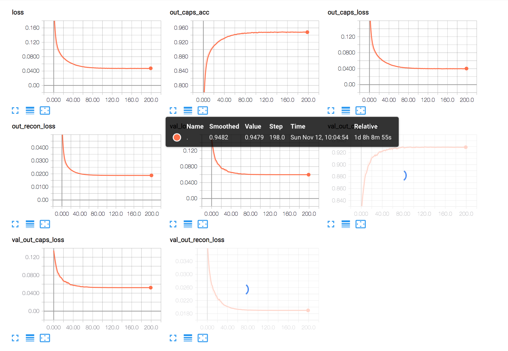
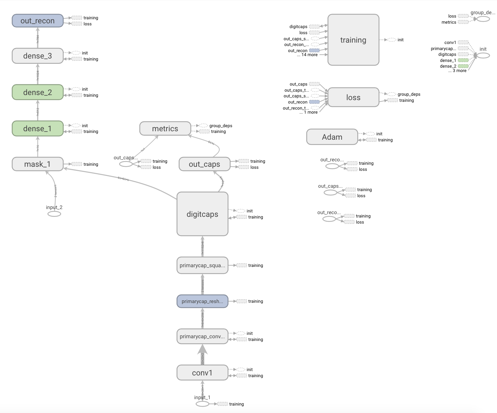
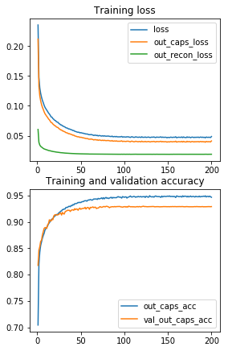

# Keras Implementation of Dynamic Routing Between Capsules of Zalando Fashion MNIST Data 

[](CONTRIBUTING.md)
[](https://opensource.org/licenses/Apache-2.0)


This ia a barebone CUDA-enabled Keras implementation of the CapsNet architecture in the paper "Dynamic Routing Between Capsules".

A Keras implementation of CapsNet in the paper:   
[Sara Sabour, Nicholas Frosst, Geoffrey E Hinton. Dynamic Routing Between Capsules. NIPS 2017](https://arxiv.org/abs/1710.09829)

This code is adopted from [CapsNet-Keras](https://github.com/XifengGuo/CapsNet-Keras.git) to test
the performance of CapsNet on [Fashion-MNIST](https://github.com/zalandoresearch/fashion-mnist)

## Description

> A capsule is a group of neurons whose activity vector represents the instantiation parameters of a specific type of entity such as an object or object part. We use the length of the activity vector to represent the probability that the entity exists and its orientation to represent the instantiation paramters. Active capsules at one level make predictions, via transformation matrices, for the instantiation parameters of higher-level capsules. When multiple predictions agree, a higher level capsule becomes active. We show that a discrimininatively trained, multi-layer capsule system achieves state-of-the-art performance on MNIST and is considerably better than a convolutional net at recognizing highly overlapping digits. To achieve these results we use an iterative routing-by-agreement mechanism: A lower-level capsule prefers to send its output to higher level capsules whose activity vectors have a big scalar product with the prediction coming from the lower-level capsule.

**Routing Algorithm**


**Margin Loss for Digita Existence**

<a href="https://www.codecogs.com/eqnedit.php?latex=L_c&space;=&space;T_c&space;max(0,&space;m^&plus;&space;-&space;||v_c||)^2&space;&plus;&space;\lambda&space;(1&space;-&space;T_c)&space;max(0,&space;||v_c||&space;-&space;m^-)^2" target="_blank"></a>

**Architechture Layer**

A 3-layer CapsNet architecture.


**Decoder Layer**


Paper written by Sara Sabour, Nicholas Frosst, and Geoffrey E. Hinton. For more information, please check out the paper [here](https://arxiv.org/abs/1710.09829).

__Note__: Affine-transformations for the data augmentation stage have not been implemented yet. This implementation only provides an efficient implementation for the dynamic routing procedure, example CapsNet architecture, and squashing functions mentioned in the paper.

## Requirements

* Python 3 (Mine is 3.6.x distro)
* Keras 2.0.9 (latest version)
* TensorFlow
* Zalando Dataset

## Usage

**Step 1** Adjust the "hyperparamters" in the cell block and play with the results such as number of training epochs, batch sizes, etc. inside `capsule_network.py`.

```python
batch_size     = 128
epochs         = 200
lam_recon      = 0.392  # 784 * 0.0005, paper uses sum of SE, here uses MSE
num_routing    = 3      # num_routing should > 0
shift_fraction = 0.1
debug          = 0      # debug>0 will save weights by TensorBoard
save_dir       ='./result'
is_training    = 1
weights        = None
lr             = 0.001
```

Follow the simple instructions in this Jupyter Notebook.

## Usage

**Step 1.
Install [Keras 2.0.9](https://github.com/fchollet/keras) 
with [TensorFlow](https://github.com/tensorflow/tensorflow) backend.**
```
pip install tensorflow-gpu
pip install keras==2.0.9
Create your own fashion.py file from keras if you can't import it from keras.datasets (I was having this trouble all the tome)
```

**Step 2. Clone this repository to local. OR just copy these files [from CapsNet folder] to your local machine**
```
git clone https://github.com/TarrySingh/Artificial-Intelligence-Deep-Learning-Machine-Learning-Tutorials.git
cd CapsNet-Fashion-MNIST
```

**Step 3. Train a CapsNet on Fashion-MNIST**  

Training with default settings:

--> Just run the Jupyter Notebook 😁

Data preprocessing: 
- scale pixel values to `[0,1]`; 
- shift 2 pixels and horizontal flipping augmentation. 

## Benchmarks

Highest accuracy was [**coming soon as I'm still running it**] after 200 epochs on request of the Zalando Researcher [@HanXiao](https://github.com/hanxiao). 


## Results

**Accuracy &  Losses**   



Computation Graph...
 


**After 200 Epochs...**

**Reconstruction result**  



## TODO

* Extension to other datasets apart from MNIST.
* CIFAR10 and other datasets
* Images larger that the MNIST and CIFAR (ImageNet etc)
* More Complex Data Structures Such as Amazon Forests etc.

## Credits & Sources

Primarily referenced these two TensorFlow and Keras implementations:
1. [Keras implementation by @XifengGuo](https://github.com/XifengGuo/CapsNet-Keras)
2. [TensorFlow implementation by @naturomics](https://github.com/naturomics/CapsNet-Tensorflow)
3. [Kenta Iwasaki for making this PyTorch implementation](https://github.com/iwasaki-kenta)

Also worthwhile following a bunch of discussions here such as this: [@InnerPeace-Wu](https://github.com/InnerPeace-Wu) for a [discussion on the dynamic routing procedure](https://github.com/XifengGuo/CapsNet-Keras/issues/1) outlined in the paper.

**NOTE**: I will be rolling all these up to the main README.md file for the CapsNets detailing about what I learned from all the three implementations of Keras, PyTorch and Tensorflow. so stay tuned!
## Contact

I am testing a whole lot of new and upcoming AI and Data Models. Feel free to reach out to me if you need help or suggestions or if you have suggestions or help to offer me as well 😇

Here is my contact detail at [LinkedIn](https://www.linkedin.com/in/tarrysingh/), [Quora](https://www.quora.com/profile/Tarry-Singh) , [My Website - TarrySingh.com](https://tarrysingh.com) or simply [email](tarry.singh@gmail.com)
