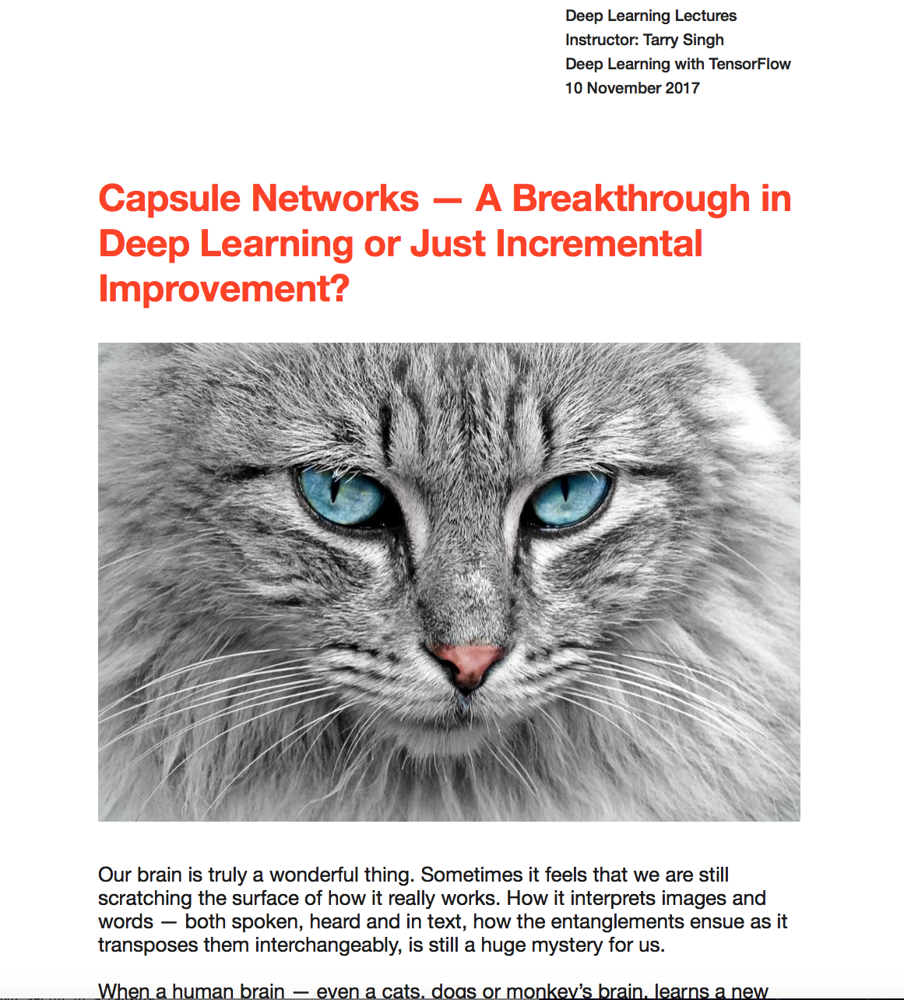

# Detailed Article about my understanding of CapsNets will feature soon!

I’ll soon be writing about my learning and understanding of CapsNet in a detailed article. This will also feature in my upcoming book.



# CapsNet with Tensorflow, PyTorch and Keras


[](CONTRIBUTING.md)
[](https://opensource.org/licenses/Apache-2.0)


A Tensorflow implementation of CapsNet in Hinton's paper [Dynamic Routing Between Capsules](https://arxiv.org/abs/1710.09829)


## Requirements and Explanation
- Python 3.x (I'm using 3.6.x)
- NumPy
- [Tensorflow](https://github.com/tensorflow/tensorflow) (I'm using 1.3.0, others should work, too)
- tqdm (for showing training progress info)
- Scipy
- Check out the *.py files if you want to play around with the hyperparameters.

Adding more detailed for those who want to understand better:

- utils.py (type `help(utils)` to see what it has ( where you download dataset and use `numpy`, `os`, `scipy` and do regular stuff such as 1) load MNIST data 2) Get batch data 3) save and merge the images
- config.py (type `help(config)` to get more info) This one is the place where your *hyperparameters* and *env variables* sit
- `capsLayer.py` (type `help(capsLayer)` for more info). This is the Capsule Layer that contains the Capsule and the Squashing function. 

 **Capsule** itself.
   ``` 
   Args:
        input: A 4-D tensor.
        num_units: integer, the length of the output vector of a capsule.
        with_routing: boolean, this capsule is routing with the
                      lower-level layer capsule.
        num_outputs: the number of capsule in this layer.
   Returns:
        A 4-D tensor.
```
and **Squash** function that bungs all the scalar values of CNN into one big giant vector.
```Squash Function
''' The routing algorithm for one capsule in the layer l+1.
    Args:
        input: A Tensor with [batch_size, num_caps_l=1152, length(u_i)=8, 1]
               shape, num_caps_l meaning the number of capsule in the layer l.
    Returns:
        A Tensor of shape [batch_size, 1, length(v_j)=16, 1] representing the
        vector output `v_j` of capsule j in the layer l+1
    Notes:
        u_i represents the vector output of capsule i in the layer l, and
        v_j the vector output of capsule j in the layer l+1.
 ```
 
 Do note (for the more curious ones 😀) that the bunging and squashing happens here (in lines approx 32 ~ 48 of this function...)
 
 ```
 capsules = []
 for i in range(self.num_units):
                # each capsule i: [batch_size, 6, 6, 32]
                with tf.variable_scope('ConvUnit_' + str(i)):
                    caps_i = tf.contrib.layers.conv2d(input,
                                                      self.num_outputs,
                                                      self.kernel_size,
                                                      self.stride,
                                                      padding="VALID")
                    caps_i = tf.reshape(caps_i, shape=(cfg.batch_size, -1, 1, 1)) # CREATE A CONV LAYER & STORE IT IN THE CAPSULE
                    capsules.append(caps_i) # HERE THE CONV LAYERS ARE ADDED INTO THE CAPSULE LIST (NESTING HAPPENS HERE)

            assert capsules[0].get_shape() == [cfg.batch_size, 1152, 1, 1]

            # [batch_size, 1152, 8, 1]
            capsules = tf.concat(capsules, axis=2)
            capsules = squash(capsules) # HERE THEY ARE ALL SQUASHED TOGETHER (WITH NON-LINEARITY FXN)
```
In summary

The whole idea is to shrink vectors -- smaller ones to zero and larger ones to slightly less than 1. Then it is "left" (God only knows that this means -- maybe someday we will have to introduce the GodOnlyKnows function 😇) to make good use of this non-linearity.

<a href="https://www.codecogs.com/eqnedit.php?latex=v_j&space;=&space;{||s_j||^2&space;\over&space;1&space;&plus;&space;||s_j||^2}" target="_blank"></a>

<a href="https://www.codecogs.com/eqnedit.php?latex=s_j&space;\over&space;||s_j||" target="_blank"></a>

where `vj` is the vector output of the capsule `j` and `sj` is its total output.

- `capsNet.py` (type `help(capsNet)` to get more details). Key functions in this class are model architecture and loss function.

*More explanation and comments coming...*


## Usage

### Training
**Step 1.** 
Clone this repository with ``git``.

```
$ git clone if you want but I'd rather just download the *.py file and tinker along if I were you!
$ create your CapsNET folder with mkdir capsNET
```

**Step 2.** 
Download [MNIST dataset](http://yann.lecun.com/exdb/mnist/), ``mv`` and extract them into ``data/mnist`` directory.(Be careful the backslash appeared around the curly braces when you copy the ``wget `` command to your terminal, remove it)

```
$ mkdir -p data/mnist
$ wget -c -P data/mnist http://yann.lecun.com/exdb/mnist/{train-images-idx3-ubyte.gz,train-labels-idx1-ubyte.gz,t10k-images-idx3-ubyte.gz,t10k-labels-idx1-ubyte.gz}
$ gunzip data/mnist/*.gz
```

**Step 3.** 
Just train using the Jupyter Notebook 😀:

## Results
Results coming soon in a day or two:

**Initial results**


Results after fix Issues #8: 

### TODO:
- Finish the MNIST version of capsNet (progress:20%)
- Do some different experiments for capsNet:
  * Using other datasets such as CIFAR
	* Adjusting model structure
  * Use with PyTorch and Keras Later

- There is [another new paper](https://openreview.net/pdf?id=HJWLfGWRb) about capsules(submitted to ICLR 2018), follow-up.
- Also follow the original Github from [Huadong Liao's here](https://github.com/naturomics/CapsNet-Tensorflow) who is doing an amazing job in improving this.
