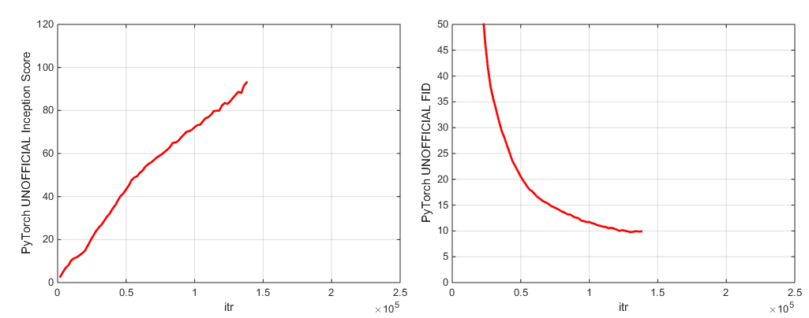

# BigGAN-PyTorch
The author's officially unofficial PyTorch BigGAN implementation.


This repo contains code for 4-8 GPU training of BigGANs from [Large Scale GAN Training for High Fidelity Natural Image Synthesis](https://arxiv.org/abs/1809.11096) by Andrew Brock, Jeff Donahue, and Karen Simonyan.

This code is by Andy Brock and Alex Andonian.

## How To Use This Code
You will need:

- [PyTorch](https://PyTorch.org/), version 1.0.1
- tqdm, numpy, scipy, and h5py
- The ImageNet training set

First, you may optionally prepare a pre-processed HDF5 version of your target dataset for faster I/O. Following this (or not), you'll need the Inception moments needed to calculate FID. These can both be done by modifying and running

```sh
sh scripts/utils/prepare_data.sh
```

Which by default assumes your ImageNet training set is downloaded into the root folder `data` in this directory, and will prepare the cached HDF5 at 128x128 pixel resolution.

In the scripts folder, there are multiple bash scripts which will train BigGANs with different batch sizes. This code assumes you do not have access to a full TPU pod, and accordingly
spoofs mega-batches by using gradient accumulation (averaging grads over multiple minibatches, and only taking an optimizer step after N accumulations). By default, the `launch_BigGAN_bs256x8.sh` script trains a
full-sized BigGAN model with a batch size of 256 and 8 gradient accumulations, for a total batch size of 2048. On 8xV100 with full-precision training (no tensorcores), this script takes 15 days to train to 150k iterations.

You will first need to figure out the maximum batch size your setup can support. The pre-trained models provided here were trained on 8xV100 (16GB VRAM each) which can support slightly more than the BS256 used by default.
Once you've determined this, you should modify the script so that the batch size times the number of gradient accumulations is equal to your desired total batch size (BigGAN defaults to 2048).

Note also that this script uses the `--load_in_mem` arg, which loads the entire (~64GB) I128.hdf5 file into RAM for faster data loading. If you don't have enough RAM to support this (probably 96GB+), remove this argument.


## Metrics and Sampling


During training, this script will output logs with training metrics and test metrics, will save multiple copies (2 most recent and 5 highest-scoring) of the model weights/optimizer params, and will produce samples and interpolations every time it saves weights.
The logs folder contains scripts to process these logs and plot the results using MATLAB (sorry not sorry).

After training, one can use `sample.py` to produce additional samples and interpolations, test with different truncation values, batch sizes, number of standing stat accumulations, etc. See the `sample_BigGAN_bs256x8.sh` script for an example.

By default, everything is saved to weights/samples/logs/data folders which are assumed to be in the same folder as this repo.
You can point all of these to a different base folder using the `--base_root` argument, or pick specific locations for each of these with their respective arguments (e.g. `--logs_root`).

We include scripts to run BigGAN-deep, but we have not fully trained a model using them, so consider them untested. Additionally, we include scripts to run a model on CIFAR, and to run SA-GAN (with EMA) and SN-GAN on ImageNet. The SA-GAN code assumes you have 4xTitanX (or equivalent in terms of GPU RAM) and will run with a batch size of 128 and 2 gradient accumulations.

## An Important Note on Inception Metrics
This repo uses the PyTorch in-built inception network to calculate IS and FID. 
These scores are different from the scores you would get using the official TF inception code, and are only for monitoring purposes!
Run sample.py on your model, with the `--sample_npz` argument, then run inception_tf13 to calculate the actual TensorFlow IS. Note that you will need to have TensorFlow 1.3 or earlier installed, as TF1.4+ breaks the original IS code.

## Pretrained models

We include two pretrained model checkpoints (with G, D, the EMA copy of G, the optimizers, and the state dict):
- The main checkpoint is for a BigGAN trained on ImageNet at 128x128, using BS256 and 8 gradient accumulations, taken just before collapse, with a TF Inception Score of 97.35 +/- 1.79: [LINK](https://drive.google.com/open?id=1nAle7FCVFZdix2--ks0r5JBkFnKw8ctW)
- An earlier checkpoint of the first model (100k G iters), at high performance but well before collapse, which may be easier to fine-tune: [LINK](https://drive.google.com/open?id=1dmZrcVJUAWkPBGza_XgswSuT-UODXZcO)


Pretrained models for Places-365 coming soon.

This repo also contains scripts for porting the original TFHub BigGAN Generator weights to PyTorch. See the scripts in the TFHub folder for more details.

## Fine-tuning, Using Your Own Dataset, or Making New Training Functions


If you wish to resume interrupted training or fine-tune a pre-trained model, run the same launch script but with the `--resume` argument added. 
Experiment names are automatically generated from the configuration, but can be overriden using the `--experiment_name` arg (for example, if you wish to fine-tune a model using modified optimizer settings).

To prep your own dataset, you will need to add it to datasets.py and modify the convenience dicts in utils.py (dset_dict, imsize_dict, root_dict, nclass_dict, classes_per_sheet_dict) to have the appropriate metadata for your dataset.
Repeat the process in prepare_data.sh (optionally produce an HDF5 preprocessed copy, and calculate the Inception Moments for FID).

By default, the training script will save the top 5 best checkpoints as measured by Inception Score. 
For datasets other than ImageNet, Inception Score can be a very poor measure of quality, so you will likely want to use `--which_best FID` instead.

To use your own training function (e.g. train a BigVAE): either modify train_fns.GAN_training_function or add a new train fn and add it after the `if config['which_train_fn'] == 'GAN':` line in `train.py`.


## Neat Stuff
- We include the full training and metrics logs [here](https://drive.google.com/open?id=1ZhY9Mg2b_S4QwxNmt57aXJ9FOC3ZN1qb) for reference. I've found that one of the hardest things about re-implementing a paper can be checking if the logs line up early in training,
especially if training takes multiple weeks. Hopefully these will be helpful for future work.
- We include an accelerated FID calculation--the original scipy version can require upwards of 10 minutes to calculate the matrix sqrt, this version uses an accelerated PyTorch version to calculate it in under a second.
- We include an accelerated, low-memory consumption ortho reg implementation.
- By default, we only compute the top singular value (the spectral norm), but this code supports computing more SVs through the `--num_G_SVs` argument.

## Key Differences Between This Code And The Original BigGAN
- We use the optimizer settings from SA-GAN (G_lr=1e-4, D_lr=4e-4, num_D_steps=1, as opposed to BigGAN's G_lr=5e-5, D_lr=2e-5, num_D_steps=2).
While slightly less performant, this was the first corner we cut to bring training times down.
- By default, we do not use Cross-Replica BatchNorm (AKA Synced BatchNorm). 
The two variants we tried (a custom, naive one and the one included in this repo) have slightly different gradients (albeit identical forward passes) from the built-in BatchNorm, which appear to be sufficient to cripple training.
- Gradient accumulation means that we update the SV estimates and the BN statistics 8 times more frequently. This means that the BN stats are much closer to standing stats, and that the singular value estimates tend to be more accurate.
Because of this, we measure metrics by default with G in test mode (using the BatchNorm running stat estimates instead of computing standing stats as in the paper). We do still support standing stats (see the sample.sh scripts).
This could also conceivably result in gradients from the earlier accumulations being stale, but in practice this does not appear to be a problem.
- The currently provided pretrained models were not trained with orthogonal regularization. Training without ortho reg seems to increase the probability that models will not be amenable to truncation,
but it looks like this particular model got a winning ticket. Regardless, we provide two highly optimized (fast and minimal memory consumption) ortho reg implementations which directly compute the ortho reg. gradients.

## A Note On The Design Of This Repo
This code is designed from the ground up to serve as an extensible, hackable base for further research code. 
We've put a lot of thought into making sure the abstractions are the *right* thickness for research--not so thick as to be impenetrable, but not so thin as to be useless.
The key idea is that if you want to experiment with a SOTA setup and make some modification (try out your own new loss function, architecture, self-attention block, etc) you should be able to easily do so just by dropping your code in one or two places, without having to worry about the rest of the codebase.
Things like the use of self.which_conv and functools.partial in the BigGAN.py model definition were put together with this in mind, as was the design of the Spectral Norm class inheritance.

With that said, this is a somewhat large codebase for a single project. While we tried to be thorough with the comments, if there's something you think could be more clear, better written, or better refactored, please feel free to raise an issue or a pull request.

## Feature Requests
Want to work on or improve this code? There are a couple things this repo would benefit from, but which don't yet work.

- Synchronized BatchNorm (AKA Cross-Replica BatchNorm). We tried out two variants of this, but for some unknown reason it crippled training each time.
  We have not tried the [apex](https://github.com/NVIDIA/apex) SyncBN as my school's servers are on ancient NVIDIA drivers that don't support it--apex would probably be a good place to start. 
- Mixed precision training and making use of tensorcores. This repo includes a naive mixed-precision Adam implementation which works early in training but leads to early collapse, and doesn't do anything to activate tensorcores (it just reduces memory consumption).
  As above, integrating [apex](https://github.com/NVIDIA/apex) into this code and employing its mixed-precision training techniques to take advantage of tensorcores and reduce memory consumption could yield substantial speed gains.

## Misc Notes
See [This directory](https://gist.github.com/yrevar/942d3a0ac09ec9e5eb3a) for ImageNet labels.

If you use this code, please cite
```text
@inproceedings{
brock2018large,
title={Large Scale {GAN} Training for High Fidelity Natural Image Synthesis},
author={Andrew Brock and Jeff Donahue and Karen Simonyan},
booktitle={International Conference on Learning Representations},
year={2019},
url={https://openreview.net/forum?id=B1xsqj09Fm},
}
```

## Acknowledgments
Thanks to Google for the generous cloud credit donations.

[SyncBN](https://github.com/vacancy/Synchronized-BatchNorm-PyTorch) by Jiayuan Mao and Tete Xiao.

[Progress bar](https://github.com/Lasagne/Recipes/tree/master/papers/densenet) originally from Jan Schlüter.

Test metrics logger from [VoxNet.](https://github.com/dimatura/voxnet)

PyTorch [implementation of cov](https://discuss.PyTorch.org/t/covariance-and-gradient-support/16217/2) from Modar M. Alfadly.

PyTorch [fast Matrix Sqrt](https://github.com/msubhransu/matrix-sqrt) for FID from Tsung-Yu Lin and Subhransu Maji.

TensorFlow Inception Score code from [OpenAI's Improved-GAN.](https://github.com/openai/improved-gan)

