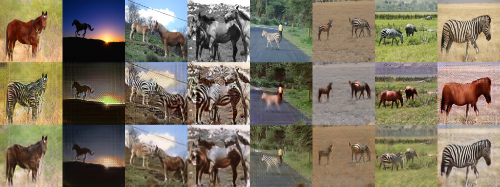
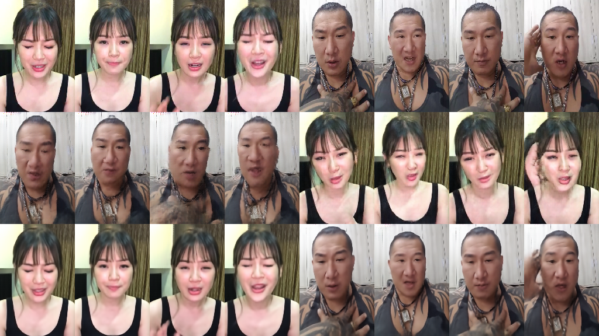
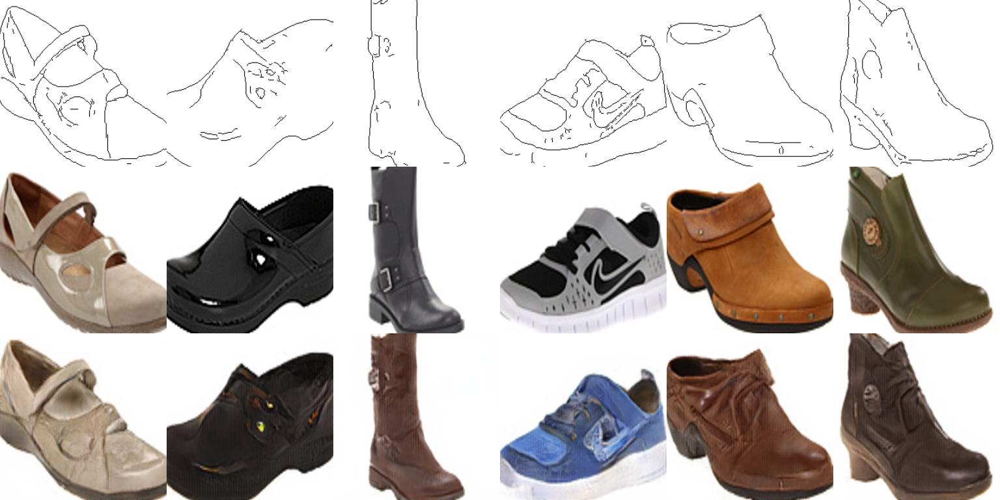
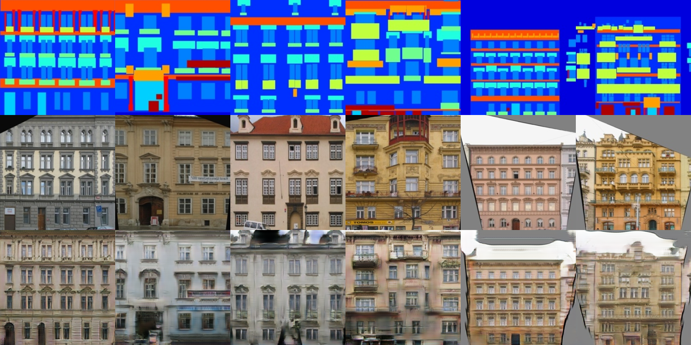
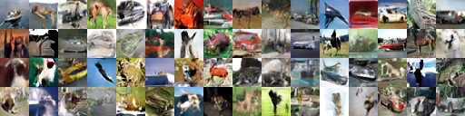
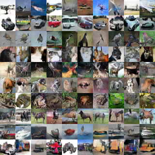
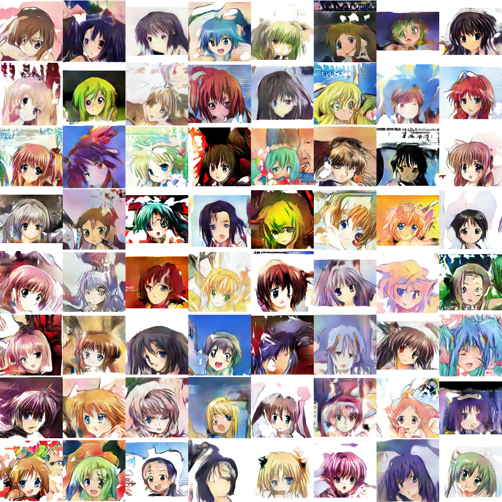
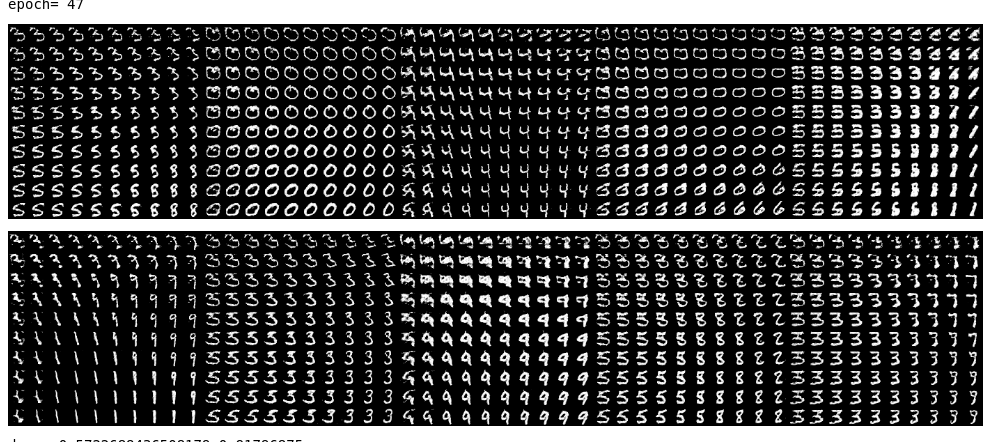
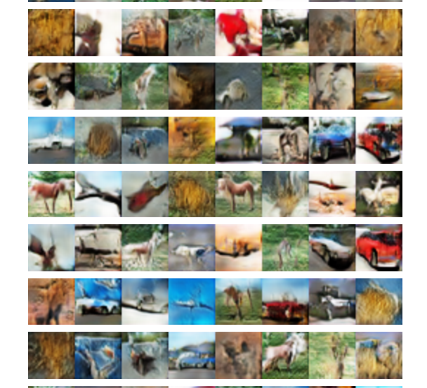

# Generative Adversarial Notebooks
## Collection of my Generative Adversarial Network implementations

Most codes are for python3, most notebooks works on 

### CycleGAN
* CycleGAN-lasagne
* CycleGAN-keras

### CycleGAN results
 
Result after 3 hours and 58 epochs on a GTX 1080. From top to bottom: Input, Fake, Recreate of the input.

 
Face-off result. From top to bottom: Input, Fake, Recreate of the input.
[youtube video](https://www.youtube.com/watch?v=Fea4kZq0oFQ)

### pix2pix
* pix2pix-keras: pix2pix GAN Keras implementation
* pix2pix-lasagne: pix2pix GAN Lasagne implementation
* pix2pix-torch: pix2pix GAN pytorch implementation

### pix2pix sample results

Validation result of edges-to-shoes after 12 epochs. From top to bottom: Input, Ground truth, the result.

Validation result of  facades dataset after 150 epochs using resnet. From top to bottom: Input, Ground truth, the result.

### WGAN on CIFAR10
* wgan-keras: Wasserstein GAN  Keras implementation
* wgan-lasagne: Wasserstein GAN Lasagne implementation
* wgan-torch: Wasserstein GAN pytorch implementation based on https://github.com/martinarjovsky/WassersteinGAN

### WGAN2 (improved WGAN/WGAN-gp)
* wgan2-lasagne:  improved WGAN Lasagne implementation (on CIFAR10)
* wgan2-keras: improved WGAN Keras implementation (on CIFAR10)
* wgan2-lasagne-anime: WGAN on anime face images, lasagne 
* wgan2-AC-lasagne:  improved WGAN Lasagne implementation with Auxillary classfier
### WGAN2 sample results
* cifar10 dataset

* cifar10 dataset with Auxillary classfier

* anime face dataset

### InfoGAN 
* mnist-infogan: InfoGAN Lasagne on MNIST dataset
* mnist-infogan-paper-uniform: InfoGAN Lasagne on MNIST dataset (fllowing the paper implementation)
### InfoGAN sample results

### DCGAN
* dcgan-lasagne: DCGAN in Lasagne
### DCGAN sample results

