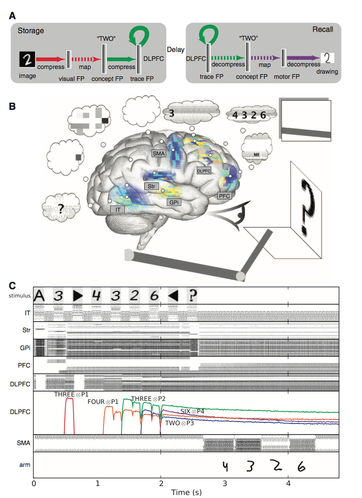

# Evolutionary Neurual Network Frameworks

## Nengo

[Nengo](https://www.nengo.ai) is a graphical and scripting based software package for simulating large-scale neural systems. The book How to build a brain, which includes Nengo tutorials, is now available. This website also has additional information on the book.

To use Nengo, you define groups of neurons in terms of what they represent, and then form connections between neural groups in terms of what computation should be performed on those representations. Nengo then uses the Neural Engineering Framework (NEF) to solve for the appropriate synaptic connection weights to achieve this desired computation. Nengo also supports various kinds of learning. Nengo helps make detailed spiking neuron models that implement complex high-level cognitive algorithms.

Among other things, Nengo has been used to implement motor control, visual attention, serial recall, action selection, working memory, attractor networks, inductive reasoning, path integration, and planning with problem solving (see the model archives and publications for details).

Here's a small explanation of Nengo

[Nengo Video Example](https://youtu.be/P_WRCyNQ9KY)

Chris Eliasmith has also written a book called ["How to build a brain"](https://www.amazon.com/How-Build-Brain-Architecture-Architectures/dp/0190262125)

## Wyrm

Wyrm is a Brain Computer Interface (BCI) toolbox written in Python. Wyrm is suitable for running on-line BCI experiments as well as off-line analysis of EEG data.

Online documentation is available [here](http://bbci.github.io/wyrm/) and a full explanation of architecture and methdology is [here](https://www.ncbi.nlm.nih.gov/pmc/articles/PMC4626531/)

## Blue Brain Project

The Blue Brain Python Optimisation Library (BluePyOpt) is an extensible framework for data-driven model parameter optimisation that wraps and standardises several existing open-source tools.

It simplifies the task of creating and sharing these optimisations, and the associated techniques and knowledge. This is achieved by abstracting the optimisation and evaluation tasks into various reusable and flexible discrete elements according to established best-practices.

Further, BluePyOpt provides methods for setting up both small- and large-scale optimisations on a variety of platforms, ranging from laptops to Linux clusters and cloud-based compute infrastructures.

For more information, go [here](https://github.com/BlueBrain/BluePyOpt)

### Digital Reconstruction of Brain

Neural Slice Preview

Digital reconstructions of brain tissue represent a snapshot of the anatomy and physiology of the brain at one moment in time.  BBP simulations use mathematical models of individual neurons and synapses to compute the electrical activity of the network as it evolves over time. This requires a huge computational effort, only possible with large supercomputers. Simulations of larger volumes of tissue, at ever higher levels of detail, will need ever more powerful computing capabilities.

The BBP uses its digital reconstructions as the basis for a potentially unlimited range of simulations, each representing an in silico experiment. Researchers can measure the spontaneous electrical activity of the virtual tissue, apply stimulation protocols and measure the response, and manipulate the tissue in various ways (e.g. by “knocking out” cells with particular characteristics, by “lesioning” part of the circuit). In silico experiments can replicate past laboratory experiments – an important test for the reconstructions – or can explore new ground and suggest new experiments. In particular, simulation allows experiments that would be difficult or impossible in biological tissue or in living animals – for instance, experiments requiring simultaneous measurements from large numbers of neurons. Such experiments provide a new tool for researchers seeking to understand the causal relationships between events at different levels of brain organization. - for example, understanding on how changes in composition of the extra-cellular fluid (which impact the activity of synapses) affect the overall pattern of activity in the virtual tissue.

As digital reconstructions become larger, more detailed and more biologically accurate, the range of experiments they enable will grow. The Blue Brain Project is currently building neurorobotics tools in which brain simulations are coupled to simulated robots and a simulated environment, in a  “closed loop”. The new tools will make it possible to replicate cognitive and behavioural experiments in animals, where the animal’s sensory organs capture and encode information about its environment, and its brain generates a motor response. This approach will enable early in silico studies of the brain mechanisms underlying animal perception, cognition and behaviour.

## 

